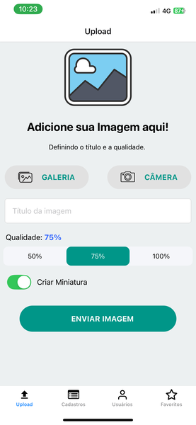
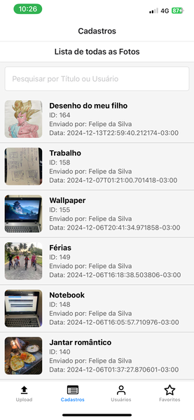
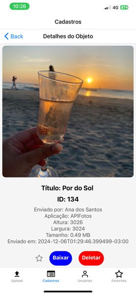
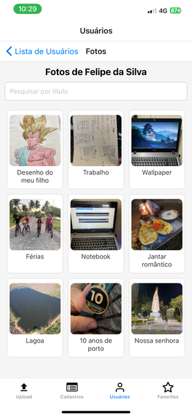
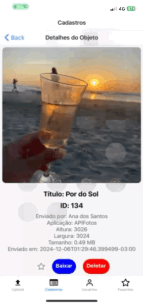

# 📷 React Native - Gestão de Imagens 📱

Este é um aplicativo **React Native** para gerenciamento de imagens. O projeto foi desenvolvido com o objetivo de possibilitar o **upload**, **visualização**, **organização** e **remoção** de imagens, utilizando um **banco de dados PostgreSQL** local para armazenar informações relacionadas.

---

## ✨ Funcionalidades

- **Upload de imagens**: Selecione imagens da galeria ou tire uma nova foto com a câmera do dispositivo.
- **Visualização de imagens**: Veja imagens em alta qualidade com informações detalhadas, como título, autor e data de envio.
- **Miniaturas**: Miniaturas são geradas automaticamente para exibição em listas.
- **Favoritos**: Marque imagens como favoritas e acesse-as rapidamente na aba de Favoritos.
- **Organização**:
  - Listagem de imagens ordenadas por ID ou data de envio.
  - Pesquisa por título ou autor.
- **Usuários cadastrados**: Veja os usuários com uploads e o número de imagens de cada um.
- **Download de imagens**: Baixe as imagens diretamente para a galeria do dispositivo.
- **Exclusão de imagens**: Remova imagens da lista com confirmação de segurança.

---

## 🛠️ Tecnologias Utilizadas

- **React Native**: Framework para desenvolvimento de aplicativos mobile.
- **Expo**: Ferramenta para facilitar o desenvolvimento e teste.
- **PostgreSQL**: Banco de dados relacional usado para armazenar informações de imagens e usuários.
- **Axios**: Para realizar chamadas HTTP à API.
- **AsyncStorage**: Para armazenar localmente os IDs de favoritos.
- **React Navigation**: Para navegação entre telas no app.
- **react-native-switch-selector**: Para melhorar a UX com alternadores intuitivos para seleção de qualidade.

---

## 🚀 Como Executar o Projeto

### Consumo de API
Este aplicativo consome os dados de uma API desenvolvida em .NET, disponível no seguinte repositório:
- **API:** [FotosAPI](https://github.com/cirotorres/FotosAPI/)

Certifique-se de clonar e configurar a API para que a aplicação possa funcionar corretamente. A API é responsável por:
- Gerenciar os uploads de imagens.
- Fornecer as informações detalhadas sobre as imagens
- Gerenciar usuários e relacionar imagens com seus respectivos autores.

Para mais informações leia o README da API. 

### Passos para API

1. Clone o repositório da API:
   ```bash
   git clone https://github.com/cirotorres/FotosAPI.git
   ```
2. Navegue para o diretório do projeto:
   ```bash
   cd FotosAPI
   ```
3. Inicie o servidor:
   ```bash
   dotnet run
   ```
2. Use o Swagger ou Postman para gerar o token:

 - http://localhost:5216/swagger/index.html

 - Gere o Token, copie e cole no diretório do Aplicativo (src -> Services -> token.tsx) 
  

### Pré-requisitos

- [Node.js](https://nodejs.org/)
- [Expo CLI](https://expo.dev/)
- [PostgreSQL](https://www.postgresql.org/) instalado e configurado localmente.
- Sua API rodando localmente. Por padrão, o app está configurado para acessar `http://localhost:5216`.

### Passos para Aplicação

1. Clone este repositório:
   ```bash
   git clone https://github.com/cirotorres/RNFotosAPI.git
   ```
2. Navegue para o diretório do projeto:
   ```bash
   cd RNFotosAPI
   ```
3. Instale as dependências:
   ```bash
   npm install
   ```
4. Inicie o servidor Expo:
   ```bash
   npm start
   ```
5. Teste o aplicativo em seu dispositivo Android ou iOS usando o aplicativo **Expo Go** ou emuladores configurados.

---

## 📚 Estrutura do Projeto

```
💂 src
 ├ 📂 assets           # Imagens e ícones do app
 ├ 📂 services         # Configurações de API e comunicação
 ├ 📂 routes           # Rotas das páginas da aplicação
 └ 📂 pages            # Páginas do aplicativo
```

---

## 🖼 Visualização do App

### 🔀 Demonstrações

| **Página**             | **GIF/Imagem**                                      |
|------------------------|-----------------------------------------------------|
| **Tela Inicial**       |                   |
| **Lista de Imagens**   |                   |
| **Detalhes**           |                |
| **Fotos do Usuário**   |               |
| **Favoritos**          |              |

---

## 🎲 Banco de Dados

O banco de dados **PostgreSQL** armazena as seguintes informações:

- **Tabela `images`**:
  - `id` (chave primária)
  - `title`
  - `uploadedBy`
  - `uploadedAt`
  - `thumbPath` (base64 ou URL)
  - ...

As consultas e operações são realizadas pela API .NET local.

---

## ⚙️ Configuração da API

Certifique-se de que sua API .NET está configurada corretamente:

1. O arquivo `appsettings.json` deve incluir as configurações do PostgreSQL.
2. A API precisa estar rodando no endereço configurado no aplicativo (`http://localhost:5216`).

---

## 📞 Contato

- **Email:** ciro_3@hotmail.com
- **LinkedIn:** [Ciro Torres](https://www.linkedin.com/in/ciroptorres)

---

🚀 **Agradeço por explorar este projeto!**
